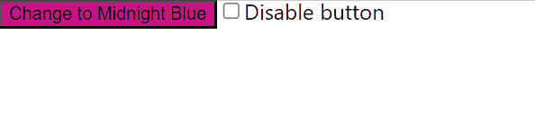
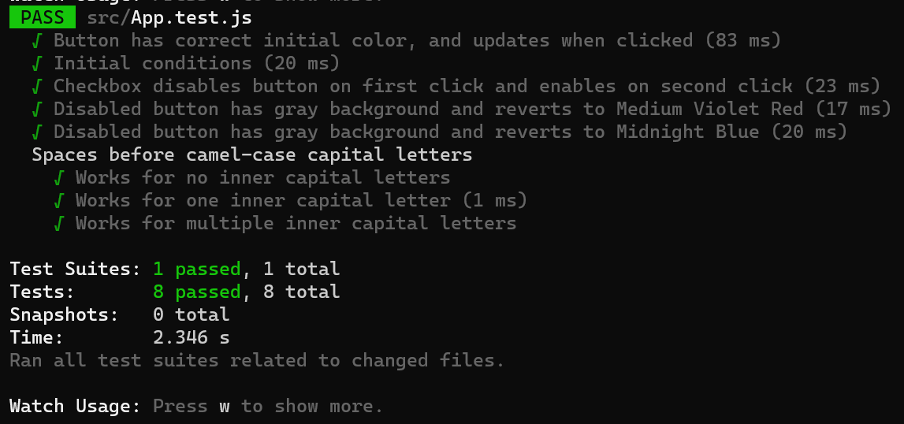

# Color Button App
A dead simple app built for learning how to test code with **Jest** and practice Test-Driven Development (TDD) with React.  

## Aim
1. To create a button that toggles the background color of the color between the colors 'Medium Violet Red' and 'Midnight Blue'.
2. To create a checkbox that enables and disables the button, turning the button gray when disabled.

<p align="center">
  
</p>

## Concepts used
### React Testing Library:
1. ```render``` method for rendering the React component that we want to test into the testing environment
2. ```screen``` object from React Testing Library provides methods for querying the rendered elements of the DOM, before we can make any assertions
    * Identifying the element we want with ```screen.getByRole('<role_name>', { name: 'xxx' })```, using the name option 
4. The helper function ```logRoles()``` from React Testing Library to print out a list of all implisit ARIA roles within a tree of DOM nodes. This is helpful for finding ways to query the DOM under test with ```.getByRole()```
5. Testing interactivity with ```fireEvent```object which provides methods like ```.click()``` (from React Testing Library). ```fireEvent.click(<some_element>)``` will dispatch the click event on the specified DOM node

### Jest:
4. Jest-DOM Assertions
    1. ```toHaveStyle()```
    2. ```toHaveTextContent()```
    3. ```toBeEnabled()```
    4. ```toBeChecked()``` (for checkboxes)
5. Jest's ```describe()``` to group tests into logical groups


## Testing
**Tests written (in App.test.js):**
1. Button has correct initial color, and updates when clicked 
2. Initial conditions 
3. Checkbox disables button on first click and enables on second click 
4. Disabled button has gray background and reverts to Medium Violet Red 
5. Disabled button has gray background and reverts to Midnight Blue 
6. Spaces before camel-case capital letters
    1. Works for no inner capital letters
    2. Works for one inner capital letter 
    3. Works for multiple inner capital letters


Upon running Jest with **npm test**: 
<p align="center">
  
</p>


